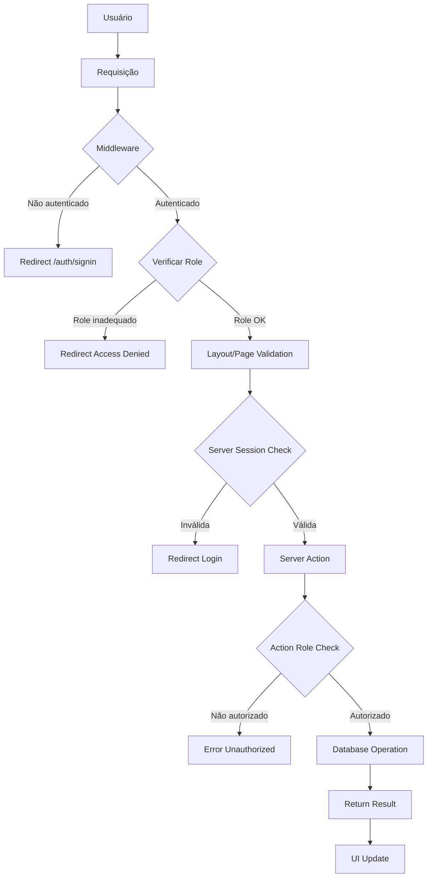

# 🔐 Fluxo de Autenticação e Autorização - Diagrama Detalhado

## 📊 Arquitetura de Segurança



## 🛡️ Camadas de Proteção Detalhadas

### 1️⃣ Camada de Middleware
```typescript
// Executa ANTES de qualquer página/API
// Proteção global de rotas
┌─────────────────────────────────────┐
│  Request → Middleware → Route       │
│                                     │
│  Verifica:                          │
│  ✓ Token JWT válido                 │
│  ✓ Role adequado para rota          │
│  ✓ Redirecionamentos necessários    │
└─────────────────────────────────────┘
```

### 2️⃣ Camada de Layout/Page
```typescript
// Server Components - executa no servidor
// Validação adicional de sessão
┌─────────────────────────────────────┐
│  Layout → getServerSession         │
│                                     │
│  Verifica:                          │
│  ✓ Sessão ativa no servidor         │
│  ✓ Role específico da página        │
│  ✓ Permissões granulares            │
└─────────────────────────────────────┘
```

### 3️⃣ Camada de Server Actions
```typescript
// Validação antes de operações CRUD
// Proteção de mutations
┌─────────────────────────────────────┐
│  Action → Session Check → DB        │
│                                     │
│  Verifica:                          │
│  ✓ Usuário logado                   │
│  ✓ Permissão para ação específica   │
│  ✓ Ownership de recursos            │
└─────────────────────────────────────┘
```

### 4️⃣ Camada de UI (Client)
```typescript
// React Hooks - controle de interface
// Feedback visual baseado em permissões
┌─────────────────────────────────────┐
│  Component → useAuth → Render       │
│                                     │
│  Controla:                          │
│  ✓ Botões visíveis por role         │
│  ✓ Menus condicionais               │
│  ✓ Funcionalidades disponíveis      │
└─────────────────────────────────────┘
```

## 🔄 Estados de Autenticação

```
┌─────────────┐    ┌─────────────┐    ┌─────────────┐
│   LOADING   │ → │ UNAUTHENT.  │ → │ REDIRECTING │
│             │    │             │    │             │
│ Carregando  │    │ Não logado  │    │ Para login  │
│ sessão...   │    │             │    │             │
└─────────────┘    └─────────────┘    └─────────────┘
                            │
                            ▼
┌─────────────┐    ┌─────────────┐    ┌─────────────┐
│ AUTHORIZED  │ ← │ AUTHENTICATED│ → │ UNAUTHORIZED│
│             │    │             │    │             │
│ Acesso OK   │    │ Logado com  │    │ Sem permis. │
│             │    │ sucesso     │    │ para página │
└─────────────┘    └─────────────┘    └─────────────┘
```

## 🎯 Mapeamento de Rotas por Role

### CUSTOMER (Cliente)
```
✅ Permitido:
/                  # Home
/cursos           # Lista de cursos
/cursos/[slug]    # Curso específico
/mmr              # Verificação MMR
/community        # Comunidade
/prices           # Preços
/auth/*           # Autenticação

❌ Negado:
/dashboard/*      # Admin only
/admin/*          # Admin only
```

### PROFESSIONAL (Instrutor)
```
✅ Permitido:
Tudo do CUSTOMER +
/dashboard/lessons  # Gerenciar próprias aulas (futuro)

⚠️ Limitado:
/dashboard/users    # Apenas visualização (futuro)

❌ Negado:
/dashboard/admin/*  # Admin only
```

### ADMIN (Administrador)
```
✅ Permitido:
TUDO - Acesso completo
/dashboard/*        # Dashboard completo
/admin/*           # Funcionalidades admin
Sistema completo   # Sem restrições
```

## 🔧 Implementação Técnica

### NextAuth Configuration
```typescript
// src/lib/auth.ts
export const authOptions: NextAuthOptions = {
  callbacks: {
    async jwt({ token, user }) {
      if (user) {
        token.role = user.role;  // Adiciona role ao JWT
        token.id = user.id;
      }
      return token;
    },
    async session({ session, token }) {
      session.user.role = token.role;  // Disponibiliza role na sessão
      session.user.id = token.id;
      return session;
    },
    async signIn({ user, account }) {
      // Verificações de login
      const dbUser = await db.user.findUnique({
        where: { email: user.email }
      });
      return dbUser?.isActive ?? false;
    }
  }
};
```

### Middleware Protection
```typescript
// middleware.ts
export default withAuth(
  function middleware(req) {
    const { pathname } = req.nextUrl;
    const token = req.nextauth.token;
    
    // Matriz de proteção
    const protectionMatrix = {
      '/dashboard': ['ADMIN'],
      '/admin': ['ADMIN'],
      '/instructor': ['PROFESSIONAL', 'ADMIN']
    };
    
    for (const [route, allowedRoles] of Object.entries(protectionMatrix)) {
      if (pathname.startsWith(route)) {
        if (!allowedRoles.includes(token?.role)) {
          return NextResponse.redirect('/auth/signin?error=AccessDenied');
        }
      }
    }
  }
);
```

### Server Action Security
```typescript
// src/server/userActions.ts
async function requireRole(requiredRole: UserRole) {
  const session = await getServerSession(authOptions);
  
  if (!session) {
    throw new Error('Authentication required');
  }
  
  if (session.user.role !== requiredRole) {
    throw new Error('Insufficient permissions');
  }
  
  return session.user;
}

export async function deleteUser(id: string) {
  await requireRole('ADMIN');  // Só admin pode deletar
  
  return await db.user.delete({
    where: { id }
  });
}
```

### Client-Side Guards
```typescript
// src/components/AdminOnlyButton.tsx
function AdminOnlyButton({ children, ...props }) {
  const { isAdmin } = useAuth();
  
  if (!isAdmin) return null;
  
  return <Button {...props}>{children}</Button>;
}

// Uso:
<AdminOnlyButton onClick={handleDelete}>
  Deletar Usuário
</AdminOnlyButton>
```

## 📋 Checklist de Segurança

### ✅ Implementado
- [x] Middleware para proteção de rotas
- [x] Server-side validation em layouts
- [x] JWT com roles incluídas
- [x] Client-side guards para UI
- [x] Redirecionamentos apropriados
- [x] Validação em server actions (parcial)

### 🔄 Em Desenvolvimento
- [ ] Rate limiting por usuário
- [ ] Logs de auditoria
- [ ] Verificação de ownership de recursos
- [ ] Permissões granulares por feature

### 📅 Futuras Implementações
- [ ] 2FA para administradores
- [ ] Sessões múltiplas por usuário
- [ ] Permissões por recurso específico
- [ ] API Keys para integrações
- [ ] Webhook de eventos de segurança

## 🚨 Pontos de Atenção

### 1. Session Hijacking
```typescript
// Validação adicional de IP e User-Agent
if (session.ipAddress !== request.ip) {
  // Invalidar sessão suspeita
  await signOut();
}
```

### 2. Role Escalation
```typescript
// Nunca permitir alteração de próprio role
export async function updateUser(data) {
  const session = await getServerSession();
  
  if (data.id === session.user.id && data.role) {
    throw new Error('Cannot change own role');
  }
}
```

### 3. Resource Ownership
```typescript
// Verificar se usuário pode acessar recurso
export async function updateLesson(id: string, data) {
  const lesson = await db.lesson.findUnique({
    where: { id },
    include: { author: true }
  });
  
  const session = await getServerSession();
  
  if (lesson.authorId !== session.user.id && session.user.role !== 'ADMIN') {
    throw new Error('Cannot edit lesson owned by another user');
  }
}
```

---

Este diagrama complementa o documento principal e fornece uma visão técnica detalhada da implementação de segurança da aplicação.
