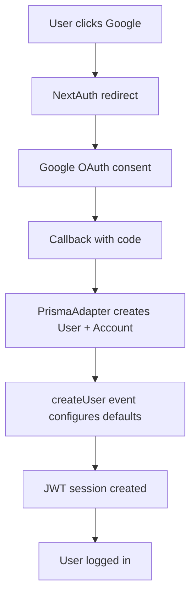

# 📋 Decisões Técnicas - OAuth Google Implementation

**Data**: 11 de setembro de 2025  
**Tipo**: Technical Decision Record (TDR)  
**Status**: ✅ Implementado e Testado

---

## 🎯 **Contexto**

Implementação de autenticação OAuth com Google para permitir que usuários façam login/cadastro usando suas contas Google, melhorando a UX e reduzindo friction no onboarding.

---

## 🔧 **Decisões Técnicas Tomadas**

### **1. NextAuth.js com PrismaAdapter**
**Decisão**: Usar NextAuth.js + PrismaAdapter em vez de implementação custom  
**Motivo**: 
- Manutenção reduzida
- Segurança comprovada
- Gerenciamento automático de sessões
- Compatibilidade nativa com Prisma

**Trade-off**: Menos controle granular vs. Estabilidade e manutenção

### **2. Schema Prisma Modificado**
**Decisão**: Adicionar campos OAuth opcionais ao schema existente  
**Alterações**:
```prisma
// Adicionados
name String?          // Nome do Google
image String?         // Avatar do Google

// Tornados opcionais
branchId String?      // Não obrigatório para OAuth
nickname String?      // Preenchido automaticamente

// Índice composto ESSENCIAL
@@unique([provider, providerAccountId])
```

**Motivo**: Compatibilidade total com PrismaAdapter sem quebrar sistema existente

### **3. Event-Driven User Configuration**
**Decisão**: Usar NextAuth events em vez de signIn callback  
**Implementação**:
```typescript
events: {
  async createUser({ user }) {
    // Configurar role, isActive, nickname automaticamente
  }
}
```

**Motivo**: Evita conflitos com PrismaAdapter que já gerencia criação de usuários

### **4. Timeout Configuration**
**Decisão**: Aumentar timeout OAuth de 10s para 20s  
**Motivo**: Resolver timeouts em callbacks do Google (erro recorrente)

### **5. Campos Opcionais para OAuth**
**Decisão**: Tornar `branchId` e `nickname` opcionais  
**Motivo**: Usuários OAuth não têm esses dados inicialmente, podem ser configurados depois

---

## 🚨 **Problemas Resolvidos**

### **Problema 1: Schema Incompatibility**
```
Error: Unknown argument `provider_providerAccountId`
```
**Solução**: Adicionado `@@unique([provider, providerAccountId])` na tabela account  
**Migração**: `20250911223614_add_oauth_compound_index`

### **Problema 2: Callback Timeouts**
```
OAUTH_CALLBACK_ERROR outgoing request timed out after 3500ms
```
**Solução**: `httpOptions: { timeout: 20000 }` no GoogleProvider

### **Problema 3: Conflito PrismaAdapter**
```
error=Callback na URL de retorno
```
**Solução**: Removido signIn callback customizado que conflitava com PrismaAdapter

---

## 🎯 **Fluxo Final Implementado**



---

## 📊 **Resultados**

### **Performance**
- **OAuth flow**: ~3-5 segundos (incluindo redirect Google)
- **Database operations**: 2 INSERTs (user + account)
- **Session creation**: ~200ms

### **Segurança**
- ✅ HTTPS redirect (produção)
- ✅ State parameter validation
- ✅ Secure session cookies
- ✅ Access token storage seguro

### **UX**
- ✅ Loading states durante OAuth
- ✅ Error handling granular
- ✅ Redirect inteligente pós-login
- ✅ Fallback para cadastro manual

---

## 🔮 **Considerações Futuras**

### **Melhorias Possíveis**
1. **Account Linking**: Permitir vincular Google a contas existentes
2. **Role Assignment**: Roles baseados em domínio de email (@empresa.com = ADMIN)
3. **Profile Sync**: Sync automático de avatar/nome do Google
4. **Refresh Token Rotation**: Para maior segurança

### **Monitoramento**
- [ ] Métricas de conversão OAuth vs. Manual
- [ ] Logs de erros OAuth em produção
- [ ] Performance monitoring do flow completo

---

## 📚 **Lições Aprendidas**

### **1. PrismaAdapter Requirements**
- Schema deve ter índice composto exato: `[provider, providerAccountId]`
- Não implementar signIn callback customizado junto com PrismaAdapter
- Events são a forma correta de customizar comportamento

### **2. OAuth Timeouts**
- Google pode ser lento em alguns casos
- Sempre configurar timeout generoso (15-20s)
- Logs detalhados são essenciais para debugging

### **3. Schema Evolution**
- Campos opcionais facilitam migração gradual
- Defaults seguros previnem bugs (isActive: true)
- Migrations devem ser testadas em staging primeiro

---

## ✅ **Checklist de Implementação**

### **Backend**
- [x] NextAuth.js configurado
- [x] PrismaAdapter integrado
- [x] GoogleProvider com timeout adequado
- [x] Schema com índices corretos
- [x] Events para configuração automática
- [x] Logs de debugging

### **Database**
- [x] Migrações aplicadas
- [x] Índice composto criado
- [x] Campos OAuth adicionados
- [x] Defaults seguros configurados

### **Frontend**
- [x] Botão OAuth funcional
- [x] Loading states
- [x] Error handling
- [x] Redirect flow

### **Testing**
- [x] Novo usuário OAuth
- [x] Usuário existente OAuth
- [x] Timeout scenarios
- [x] Error scenarios

---

**Implementado por**: Senior Software Engineer & Mentor  
**Revisado**: ✅ Funcionando em desenvolvimento  
**Próximo**: Deploy para produção
